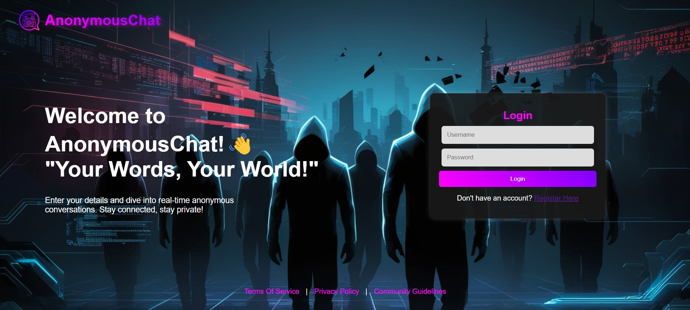
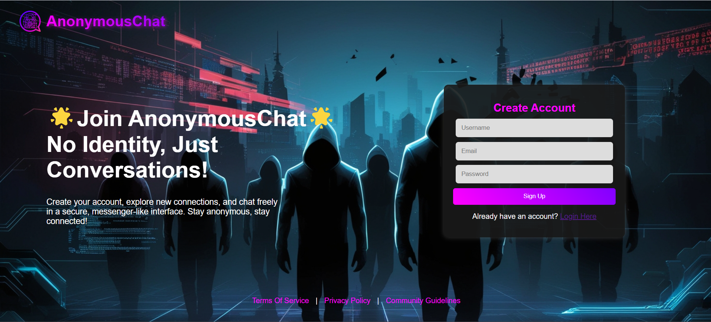
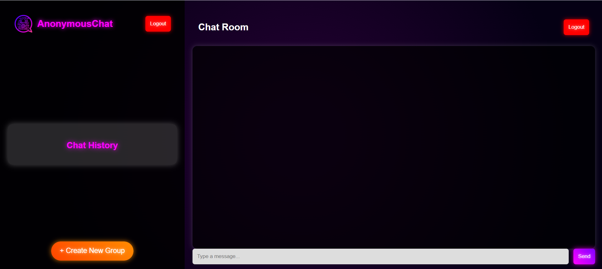
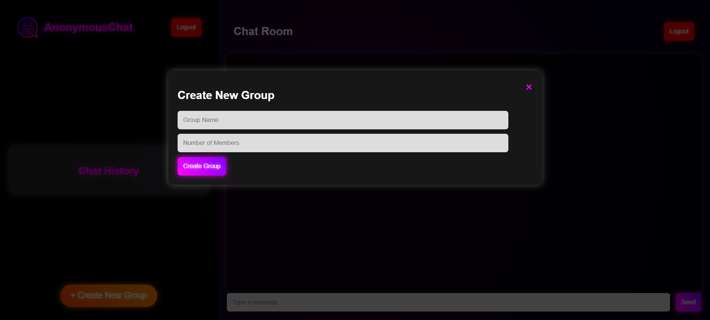

<!-- HEADER -->
<h1 align="center">
  🕵️‍♀️ AnonymousChat 🕵️‍♀️
</h1>

<p align="center">
  
</p>

<p align="center">
  
  
  
  
</p>

---

## 🧠 Overview

> AnonymousChat is a secure and dynamic chat platform that blends privacy and real-time communication. Users can register/login or join group chats anonymously via invite links.

🌟 **Perfect for:** 
- Anonymous group discussions
- Secure real-time communication
- Creative collaboration without identities

🧪 Built with:
- `Node.js` for backend
- `MySQL` for authentication storage
- `Socket.IO` for real-time communication
- `EJS` templates for frontend rendering


## 🖼️ Screenshots


### 🔐 Login Page


### ✍️ Registration Page


### 💬 Chat Interface


### 🧑‍🤝‍🧑 Creating group



---

## ⚙️ Folder Structure

```bash
COLORFULAUTH/
│
├── public/
│   ├── images/              # UI Assets
│   │   ├── background.jpg
│   │   ├── Homepage.jpg
│   │   └── logo.png
│   └── styles.css           # Glowing dark UI styles
│
├── views/
│   ├── login.ejs            # Login Page
│   ├── register.ejs         # Registration Page
│   ├── chat.ejs             # Main Chat UI
│   └── groupChat.ejs        # Group Chat UI
│
├── server.js                # Main server logic
├── package.json             # Dependencies
├── .gitignore
```

---

## 🚀 Features

| 💡 Feature                          | 🔍 Description |
|------------------------------------|----------------|
| 🧑‍💻 User Login/Register            | Login system using MySQL |
| 🕵️ Anonymous Join via Link         | No login required for guests |
| 🛡️ Group Access Control            | Only creator (admin) can remove users |
| 🧾 Stored Chat History             | Only visible to group admin |
| 🚫 Rejoin Restriction              | Removed users can’t rejoin the group |
| ✨ Glowing Buttons & Dark Theme    | Beautiful animated UI |
| 📱 Messenger-like Chat Layout      | Sidebar + Chat space |
| 🔗 Unique Invite Generation        | Custom group invite links |

---

## 🛠️ Tech Stack

| Tech         | Purpose                         |
|--------------|---------------------------------|
| Node.js      | Backend engine                  |
| Express.js   | HTTP server framework           |
| Socket.IO    | Real-time messaging             |
| MySQL        | Persistent storage              |
| EJS          | Server-side rendering engine    |
| CSS          | Glowing UI design               |

---

## 📦 Installation & Usage


# 1. Clone the repository
```bash
git clone https://github.com/nr-jisan/anonymous-chat.git
cd anonymous-chat
```

# 2. Install dependencies
```bash
npm install
```

# 3. Configure MySQL credentials in the code
```bash
npm install express mysql2 uuid socket.io express-session body-parser ejs
```

# 4. Start the server
```bash
node server.js
```

🌐 Visit `http://localhost:3000` to test it on your browser.

---

## 🔐 Database Setup

### Sample MySQL Tables
```sql
CREATE TABLE users (
  id INT AUTO_INCREMENT PRIMARY KEY,
  username VARCHAR(50) NOT NULL,
  email VARCHAR(50) NOT NULL,
  password VARCHAR(255) NOT NULL
);

CREATE TABLE groups (
  id INT AUTO_INCREMENT PRIMARY KEY,
  name VARCHAR(50),
  admin_id INT,
  limit_members INT
);

CREATE TABLE messages (
  id INT AUTO_INCREMENT PRIMARY KEY,
  group_id INT,
  sender_name VARCHAR(50),
  message TEXT,
  timestamp DATETIME DEFAULT CURRENT_TIMESTAMP
);
```

---

## 💡 Future Improvements

- 📱 Fully mobile responsive
- 🔐 End-to-end encryption
- 🎨 Custom emoji support
- 🖼️ Image sharing
- 📊 User analytics for admin

---

## 🙋‍♂️ Developer

**Md. Naimur Rahman Jisan**  
Team Leader, Full Stack Developer  
🎓 Pursuing B.Sc in CSE | 🏫 State University Of Bangladesh   
📍 Bangladesh  
**Md. Abu Nasif Ahamad Jim**  
Co-Developer   
🎓 Pursuing B.Sc in CSE | 🏫 State University Of Bangladesh   
📍 Bangladesh


---


## 📬 Let’s Connect!

<p align="center">
  
  </a>&nbsp;&nbsp;&nbsp;&nbsp;
  <a href="https://www.linkedin.com/in/naimur-rahman-jisan/" target="_blank">
    
  </a>&nbsp;&nbsp;&nbsp;&nbsp;
  <a href="https://www.instagram.com/naimurrahmanjisan99/" target="_blank">
    
  </a>&nbsp;&nbsp;&nbsp;&nbsp;
  <a href="https://www.facebook.com/nrjisan" target="_blank">
    
  </a>
</p>


---
